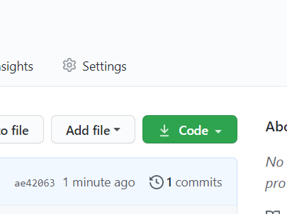
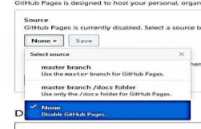
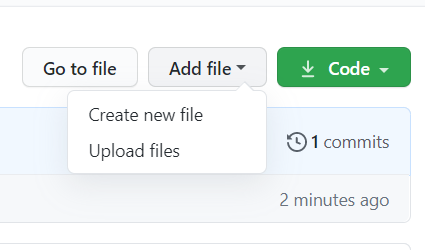
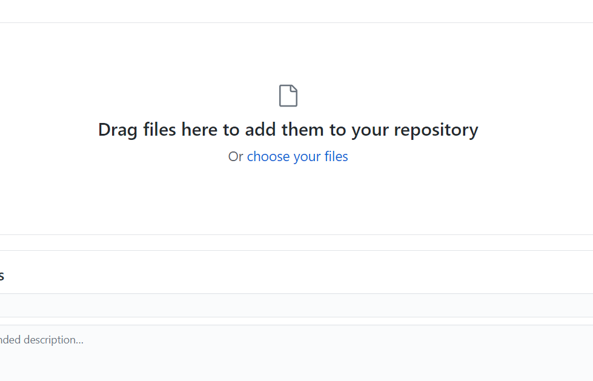
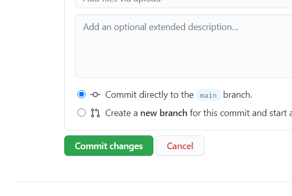

### 1. Створюємо репозиторій, додаємо все що вважаємо запотрібе, потім заходимо в Settings і у випадаючому меню Source виберіть master branch або master branch. Тепер у нас є свій сайт розміщений в Інтернеті .
### 2. Після того як створили репозиторій, нам треба завантажити файл натиснувши кнопку Upload files. У вікні натисніть на посилання Choose your files та оберіть файли.. Після цього натисніть на кнопку Commit changes для того, щоб прийняти зміни. 
